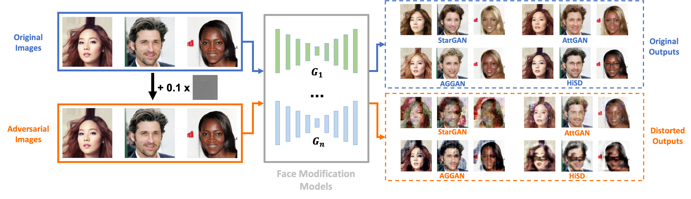
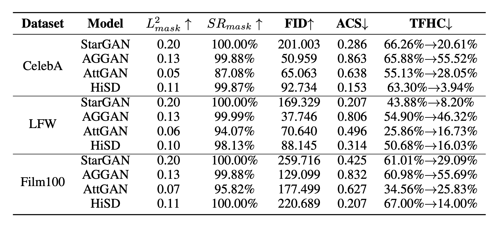

# CMUA-Watermark

The official code for CMUA-Watermark: A Cross-Model Universal Adversarial Watermark for Combating Deepfakes (AAAI2022) [arxiv](https://arxiv.org/abs/2105.10872).  It is based on [disrupting-deepfakes
](https://github.com/natanielruiz/disrupting-deepfakes). 

Contact us with huanghao@stu.pku.edu.cn, wyt@pku.edu.cn.

We will release our code soon (no later than December 31, 2021).

## Introduction

CMUA-Watermark is a **cross-model universal adversarial watermark** that can combat multiple deepfake models while protecting a myriad of facial images. With the proposed perturbation fusion strategies and automatic step size tuning, CMUA-Watermark achieves excellent protection capabilities for facial images against four face modification models (StarGAN, AttGAN, AGGAN, HiSD).

<center>

Figure 1. Illustration of our CMUA-Watermark. Once the CMUA-watermark has been generated, we can add it directly to any facial image to generate a protected image that is visually identical to the original image but can distort outputs of deepfake models.
</center>

<center>



Figure 2. The quantitative results of CMUA-Watermark.
</center>

## Usage

### Installation

1. Prepare the Environment

    - (option1) install the lib by pip (recommend)

        `
        pip install -r requirements.txt
        `

    - (option2) We also prepare conda environment for you (if you use CUDA 10.0 and conda 4.8.3) : https://disk.pku.edu.cn:443/link/D613E493EE641184EB52C0C78DD846C8 . You can donwload it and unzip in your '/anaconda3/envs/'. 
    
2. Prepare the Datasets

    - download the CelebA datasets: 
        ```
        cd stargan
        bash download.sh celeba
        ```
        make sure your floder (e.g. celeba_data) has **img_align_celeba** and **list_attr_celeba.txt**.
    - create the link
        ```
        ln -s your_path_to_celeba_data ./data
        ```

3. Prepare the Model Weights

    For your convenient usage, we prepare the weights download link in PKU disk: https://disk.pku.edu.cn:443/link/D04A3ED9D22694D81924109D0E4EACA8.
    
    You can first download the **weights**. Then move the weight files to different floders of different models:

    ``` bash
    cd CMUA-Watermark
    # make sure **weights** in this path.
    # If the paths bellow are not exist, please create the path (e.g., mkdir -p ./stargan/stargan_celeba_256/models).
    mv ./weights/stargan/* ./stargan/stargan_celeba_256/models
    mv ./weights/AttentionGAN/* ./AttentionGAN/AttentionGAN_v1_multi/checkpoints/celeba_256_pretrained
    mv ./weights/HiSD/* ./HiSD
    mv ./weights/AttGAN/* ./AttGAN/output/256_shortcut1_inject0_none/checkpoint
    ```

    **ATTENTION!** The copyright of these weight files belongs to their owners. **You needs authorization for commerce, please contact to their owners!** 

4. Prepare the CMUA-Watermark (only for inference)
   
    We prepare a CMUA-Watermark for you to test its performance: https://disk.pku.edu.cn:443/link/4FDBB772471746EC0DC397B520005D3E.
    

### Inference

``` python
# inference in CelebA datasets with 20 images (you can change the test number in evaluate.py)
python3 universal_attack_inference.py

# inference with your own image (one image)
python3 universal_attack_inference_one_image.py ./demo_input.png # you can change the path with your own image
```

### Training （attacking multiple deepfake models）

#### STEP 1 **Search Step Size with TPE ( powered by Microsoft NNI )**

If your want to try your onw idea, you may need to modify the **nni_config.yaml** and **search_space.json**. These two files are the configs of NNI-based search. Thanks to the NNI, you can obtain the visualized results in your browser.


```
nnictl create --config ./nni_config.yaml 
```

#### STEP 2 **Using the Step Sizes to train your onw CMUA-Watermark!**

Once you get the best step sizes, you need to modify the default step sizes in **setting.json**. It must be easy for a smart person like you~

After that,

``` python
python universal_attack.py
```


## Citation

If you use our code / perturbation, please consider to cite our paper: CMUA-Watermark: A Cross-Model Universal Adversarial Watermark for Combating Deepfakes.

```
@inproceedings{huang2022cmua,
  title={Cmua-watermark: A cross-model universal adversarial watermark for combating deepfakes},
  author={Huang, Hao and Wang, Yongtao and Chen, Zhaoyu and Zhang, Yuze and Li, Yuheng and Tang, Zhi and Chu, Wei and Chen, Jingdong and Lin, Weisi and Ma, Kai-Kuang},
  booktitle={Proceedings of the AAAI Conference on Artificial Intelligence},
  volume={36},
  number={1},
  pages={989--997},
  year={2022}
}
```

## License

The project is only free for academic research purposes, but needs authorization for commerce. For commerce permission, please contact wyt@pku.edu.cn.

## Thanks

We use code from [StarGAN](https://github.com/yunjey/stargan), [GANimation](https://github.com/vipermu/ganimation), [pix2pixHD](https://github.com/NVIDIA/pix2pixHD), [CycleGAN](https://github.com/junyanz/pytorch-CycleGAN-and-pix2pix), [advertorch](https://github.com/BorealisAI/advertorch), [disrupting-deepfakes](https://github.com/natanielruiz/disrupting-deepfakes) and [nni](https://github.com/microsoft/nni). These are all great repositories and we encourage you to check them out and cite them in your work.